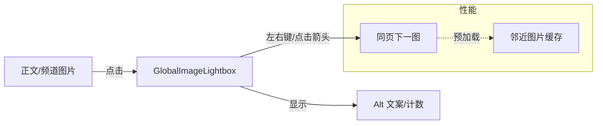

最近把样式表翻腾了一遍，顺手把自己常用的界面原语梳理下来。以后写新页面就按这套「琥珀色骨架」走，少点玄学，多点复用。

## 色彩和氛围

- 背景是暖白/深棕的双轨：`--color-bg-page` 和 `--color-bg-surface` 控制情绪，暗色模式保持同一温度，不玩高饱和冷色。
- 重点色只认一支：`--color-accent (#fb8f68)`，链接、按钮、强调都靠它，hover 只做亮度变化，不乱加阴影。
- 辅助文字层级靠 `--color-text-secondary` 与 `--color-text-muted`，正文不再直接写 hex，统一用 token。

## 版式和留白

- 布局壳：`page-shell` 负责宽度和内边距，`section-stack` 控制段落间距。主页、文章列表、通用页面都用这一对，不再各写一套 `max-w` / `py`。
- 行高回到 `--line-height-base`，标题加上紧凑的 `--line-height-tight`，保持中文阅读的气口。

## 表面与卡片

- 卡片骨架：`surface-card` + `surface-card--soft`。前者带阴影，后者更轻，用在侧栏、页脚等不抢戏的位置。
- 圆角半径维持 `--radius-lg`，阴影用 `--shadow-soft`，避免多种 box-shadow 叠加。

## 文本层级、标签、链接

- 文本层级：`text-secondary`、`text-muted` 两档就够，别在标签和日期上单独配色。
- 标签原子：`pill`，需要强调就加 `data-tone="accent"`，博客 Tag、导航徽章都复用一个样式。
- 链接下划线统一用 `underline-link`，轻微的拉伸动画，比手动写边框省心。

```html
<main class="page-shell section-stack">
  <article class="surface-card">
    <p class="text-secondary">低饱和正文示例</p>
    <a class="underline-link" href="#">带呼吸感的链接</a>
    <div class="pill" data-tone="accent">标签</div>
  </article>
</main>
```

## 互动与动效

- 主题切换、目录、导航抽屉只用透明磨砂 + 轻微缩放，不再塞多余滤镜。
- 代码块、标注、表格继续走「干净 + 一条强调色」的路线，减少背景色数量。
- 图片统一：正文/频道图默认就有阴影+圆角，hover 轻微上浮放大（无需边框就能看出是图）；点击进入全局灯箱，展示 Alt 文案并可左右切同页图片，频道图也共享。
- 漫画表情包灯箱：切换前预加载邻近图片，切换文字和图片同步显示，避免“文字先换、图后到”。

## 定妆照




## 留个钩子

后面如果再加作品页或新频道页，直接套 `page-shell → surface-card → pill / underline-link` 这一串，保证味道一致。新的模块先问问自己：能不能复用现有原语？能，就别造新花样。
