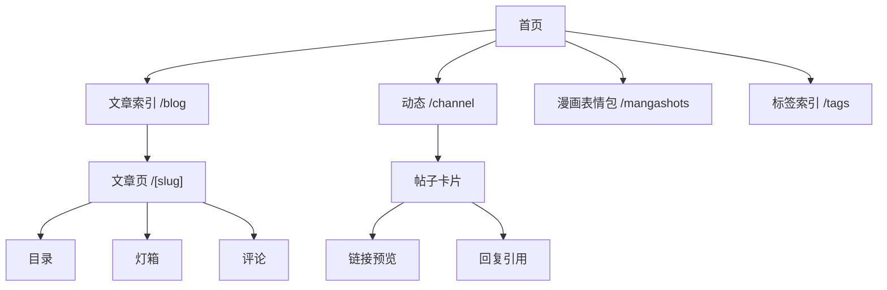

> **注**：本文主要由 AI（Claude）协助撰写整理，属于 DeepSearch 系列。内容基于实际代码库分析和设计决策记录。

这是一份设计说明书。博客完全通过 **vibe-coding** 搭建——没有前端经验，靠着直觉、Claude 的帮助和不断试错，一点点把想法变成现实。

本文采用 [Apple Human Interface Guidelines (HIG)](https://developer.apple.com/design/human-interface-guidelines) 的分类方式组织，从基础到具体：**Foundations → Patterns → Components**。

## Overview

### 设计哲学

> HIG 核心原则：**Clarity**（清晰）、**Consistency**（一致）、**Deference**（克制）

博客对这三个原则的本地化诠释：

| HIG 原则        | 博客体现                                          |
| --------------- | ------------------------------------------------- |
| **Clarity**     | 内容优先，UI 元素用途一目了然，无装饰性复杂度     |
| **Consistency** | 统一的 token 系统，相同组件在不同页面使用相同样式 |
| **Deference**   | 克制的 hover 效果，动效保持最小化，UI 不干扰阅读  |

### 博客 DNA

- **暖色调**：拒绝冷色，浅色暖白、深色夜棕
- **极简交互**：hover 只调颜色/边框，不位移
- **内容为王**：排版和组件都服务于阅读体验

### 技术栈概述

使用 [Astro](https://astro.build) 静态优先架构 + [Tailwind CSS 4](https://tailwindcss.com) 样式系统，部署在 Cloudflare Pages。详细配置见代码库。

## Foundations

### Color

> HIG: Color can provide visual continuity, communicate status information, give feedback in response to user actions, and help people visualize data.

#### 设计决策

**拒绝冷色调**——大多数博客在深色模式转向冷蓝/冷灰，但这里始终保持温暖：

- 浅色模式：暖白底 `#fffaf4`（像旧书页）
- 深色模式：暗夜棕 `#140e0b`（像老木桌）

**单一强调色：琥珀橘** `#fb8f68`

所有需要强调的元素（粗体、链接 hover、标签、按钮）都用这个颜色，形成统一的视觉节奏。

#### Token 层级

| 用途     | 浅色      | 深色      |
| -------- | --------- | --------- |
| 页面背景 | `#fffaf4` | `#140e0b` |
| 卡片背景 | `#ffffff` | `#1c1512` |
| 主要文字 | `#2a1c17` | `#f5ebe0` |
| 次要文字 | `#46342a` | `#c4b5a8` |
| 弱化文字 | `#7b6454` | `#8c7d6f` |
| 强调色   | `#fb8f68` | `#fb9f74` |

> **博客变体**：配色起点来自 [Obsidian Shiba Inu 主题](https://github.com/faroukx/Obsidian-shiba-inu-theme)，经调整形成"旧书页+琥珀"风格。

#### Tailwind 集成

色彩 token 通过 `@theme inline` 映射到 Tailwind utilities：

```css
@theme inline {
  --color-bg-page: var(--color-bg-page);
  --color-accent: var(--color-accent);
  /* ... */
}
```

使用时直接写 `bg-bg-page`、`text-accent` 等 utility class。

### Typography

> HIG: Typography helps establish hierarchy and express your app's character. Use fonts that are easy to read and complement the content.

#### 字号系统

基础字号 **17px**，符合 Apple HIG 推荐的移动端阅读标准：

| 用途    | 字号               |
| ------- | ------------------ |
| 正文    | `17px` (1.0625rem) |
| 小字    | `15px` (0.9375rem) |
| 标题 h1 | `30px` (1.875rem)  |
| 标题 h2 | `24px` (1.5rem)    |
| 标题 h3 | `20px` (1.25rem)   |

#### 行高与字距

- **标题**：`line-height: 1.22`（紧凑，强调视觉重量）
- **正文**：`line-height: 1.75`（宽松，适合长时间阅读）
- **中文字距**：`letter-spacing: 0.01em`（略微增加字间距）

#### 字体选择

> **博客变体**：使用 `jf-openhuninn-2.0`（粉圓體）而非系统字体，增加温暖手写感。

**粗体特殊处理**：所有 `<strong>` 自动应用强调色，而非仅加粗。

### Spacing & Layout

> HIG: Adequate spacing helps people focus on key information and understand the relationship between onscreen elements.

#### 设计原语

| 原语             | 用途                                                  |
| ---------------- | ----------------------------------------------------- |
| `.page-shell`    | 页面容器，最大宽度 `max-w-5xl` (1024px)，响应式内边距 |
| `.section-stack` | 纵向节奏，使用 `clamp()` 实现响应式间距               |
| `.measure`       | 正文行长 `68ch`，符合可读性推荐（60-80 字符）         |

#### 关键尺寸

| Token         | 值     | 说明                 |
| ------------- | ------ | -------------------- |
| `--space-4`   | `1rem` | 基础间距单位         |
| `--space-8`   | `2rem` | Section 上下距离     |
| `--radius-lg` | `16px` | 大圆角（卡片、图片） |
| `--radius-md` | `12px` | 中圆角（紧凑组件）   |

### Dark Mode

> HIG: Dark Mode uses a dark color palette that works system-wide and provides a comfortable viewing experience in low-light environments.

#### 切换策略

三态循环：`system → light → dark → system`

- 主题状态保存在 `localStorage`
- 页面加载时提前注入，避免 FOUC（Flash of Unstyled Content）
- 通过 `[data-theme="dark"]` 选择器切换所有 token

#### 深色模式适配

- 所有色彩 token 都有对应的深色版本
- 阴影在深色模式下更加柔和
- 保持暖色调基底（夜棕而非冷黑）

## Patterns

### Navigation

> HIG: Navigation should feel natural and unobtrusive, helping people experience and interact with your content without drawing attention to itself.

#### 桌面端

横排导航栏，固定在顶部。导航项使用统一的 hover 样式。

#### 移动端

抽屉式导航：

- 点击按钮打开，ESC 或点击遮罩关闭
- 打开时锁定 body 滚动
- 焦点管理：关闭后焦点回到触发按钮

### Content Architecture

> HIG: Give people a clear path through your experience by organizing information and flows logically.

#### 内容类型

| 类型     | 集合      | 特点                      |
| -------- | --------- | ------------------------- |
| **长文** | `blog`    | 深度文章，完整叙事        |
| **月记** | `monthly` | 生活状态，阶段总结        |
| **TIL**  | `til`     | Today I Learned，快速记录 |

三者共享统一的 frontmatter schema、排版样式（`.prose`）和标签索引系统。

#### 架构图



#### 动态内容

**Telegram 频道** (`/channel`)：

- SSR 渲染，5 分钟缓存
- 双栏布局：帖子流 + 频道信息侧边栏
- 支持链接预览、回复引用、Hashtag 标签

**漫画表情包** (`/mangashots`)：

- 无限滚动，Cloudflare D1 存储

### Modals & Overlays

> HIG: Use modality only when clarity or focus is essential. When you use modality, keep experiences brief and focused.

#### 统一组件

站点所有模态场景使用同一套实现模式：

- **灯箱**（`Lightbox.astro`）：图片预览
- **抽屉**：导航菜单、目录

#### 行为规范

| 行为 | 实现                           |
| ---- | ------------------------------ |
| 打开 | 显示 `<dialog>` 元素，锁定滚动 |
| 关闭 | ESC 键、点击遮罩、关闭按钮     |
| 焦点 | 打开时移入，关闭时回到触发元素 |

#### 滚动锁定

统一使用 `.scroll-locked` 类：

```css
body.scroll-locked {
  overflow: hidden;
}
```

## Components

### Cards

> HIG: A card displays a set of related information in a compact format, providing easy access to the actions and details the card presents.

#### 变体

| 变体                     | 用途                      |
| ------------------------ | ------------------------- |
| `.surface-card`          | 默认卡片，带边框和阴影    |
| `.surface-card--soft`    | 弱边框 + 混合背景，无阴影 |
| `.surface-card--flat`    | 无阴影，仅保留边框        |
| `.surface-card--compact` | 使用较小圆角              |

#### Hover 策略

> **博客变体**：不使用 `translateY` 上浮效果，保持视觉克制。

- `.surface-card--hover-border`：hover 时边框颜色加深
- `.surface-card--hover-none`：禁用 hover 效果

### Pills & Tags

> HIG: A tag is a keyword or label that helps identify and organize items.

`.pill` 组件用于文章标签、过滤器等场景：

- 背景使用强调色的淡化版本
- Hover 时背景加深、边框显现
- 不使用位移动效

### Code Blocks

> HIG: Present code in a way that helps people understand its structure and purpose.

#### 功能

- 语言标识（右上角）
- 复制按钮
- 双主题配色（Shiki 高亮）

#### 配色

| 模式 | 背景      |
| ---- | --------- |
| 浅色 | `#f6f8fa` |
| 深色 | `#282a36` |

### Images

> HIG: Images communicate information quickly and can make a strong emotional connection with people.

#### 正文图片

- 圆角：`16px`
- 阴影：`var(--shadow-soft)`
- 点击打开灯箱

#### 灯箱功能

`Lightbox.astro` 组件提供：

- 左右导航（键盘 ← →、触摸滑动）
- 图片计数（1 / 5）
- Alt/Caption 文本展示
- 支持动态内容（事件委托模式）
- 边界事件（可触发加载更多）

## Accessibility

> HIG: Accessibility is a core element of a great experience that helps everyone get the most from their devices.

### 对比度

所有文字配色满足 **WCAG AA** 标准（4.5:1+）：

| 文字类型 | 对比度  |
| -------- | ------- |
| 主要文字 | 12.5:1+ |
| 次要文字 | 7.2:1+  |
| 弱化文字 | 4.5:1+  |

### 键盘导航

- **ESC**：关闭所有对话框/抽屉
- **← →**：灯箱切换图片
- **Tab**：循环焦点（Trap focus）
- 清晰的 `focus-visible` 样式

### 动效降级

检测 `prefers-reduced-motion` 偏好：

```css
@media (prefers-reduced-motion: reduce) {
  html {
    scroll-behavior: auto;
  }
  *,
  *::before,
  *::after {
    animation-duration: 0.01ms !important;
    transition-duration: 0.01ms !important;
  }
}
```

### 缓存与性能

| 资源     | 策略                            |
| -------- | ------------------------------- |
| 静态文章 | 长缓存                          |
| 动态频道 | 5 分钟 + stale-while-revalidate |
| 图片代理 | 一年缓存                        |

使用 `rehype-img-size` 自动写入图片宽高，防止 CLS（Cumulative Layout Shift）。

## 参考资料

- [Apple Human Interface Guidelines](https://developer.apple.com/design/human-interface-guidelines)
- [WCAG 2.1 Understanding Docs](https://www.w3.org/WAI/WCAG21/Understanding/)
- [MDN CSS Reference](https://developer.mozilla.org/en-US/docs/Web/CSS)
- [Astro Documentation](https://docs.astro.build)
- [Tailwind CSS Documentation](https://tailwindcss.com/docs)
