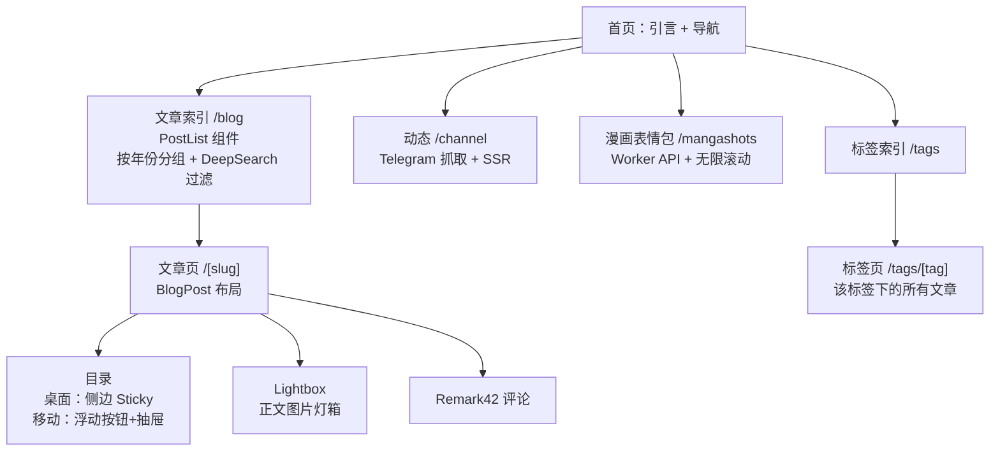

> **注**：本文主要由 AI（Claude）协助撰写整理，属于 DeepSearch 系列。内容基于实际代码库分析和设计决策记录。

这是一份迟到的设计说明书。这个博客完全是通过 **vibe-coding** 搭建起来的——没有前端经验,靠着直觉、Claude 的帮助和不断试错，一点点把想法变成现实。现在它已经有了自己的风格和韵律，是时候把这些设计决策记录下来了。

这篇文章会详细说明：

- 技术栈的选择与原因
- 色彩系统与视觉氛围
- 内容类型与信息架构
- 布局系统与排版原语
- 组件设计与交互
- 图片与媒体处理
- 性能策略
- 待重构的部分

<!-- TODO: 补充博客名称"博物志"的由来和含义 -->

---

## 技术栈：为什么这样选

### 核心框架：Astro 5

选择 [Astro](https://astro.build) 作为框架，主要基于以下考虑：

**静态优先 + 按需动态**
Astro 5 使用 `output: "static"` 模式配合 `@astrojs/cloudflare` 适配器，这意味着：

- **默认静态生成**：博客文章、策展页、主页等在构建时预渲染为 HTML
- **按需 SSR**：需要动态内容的页面（如 Telegram 频道、漫画表情包）通过 `export const prerender = false` 单独开启服务端渲染
- **零/少 JavaScript 基线**：只有必要的交互才加载 JS（导航抽屉、主题切换、目录、灯箱、评论）

> **架构演进记录**：最初采用 `output: "server"` 全站 SSR 模式，但这是一个过度设计的决策——它会强制所有页面都走服务端渲染，即使是不需要动态内容的静态文章页。这不仅增加了托管成本和复杂度，还破坏了现有的静态部署工作流。
>
> **正确做法**：保持 `output: "static"` 为全局默认，仅在需要 SSR 的页面顶部添加 `export const prerender = false`。这样既保留了静态优先的性能优势，又能灵活支持动态内容。

**Content Collections**
Astro 的内容集合系统让我可以用统一的方式管理不同类型的内容：

- `blog`：长文，深度思考
- `monthly`：月记，状态更新
- `til`：Today I Learned，短记录

每个集合共享相同的 schema（标题、日期、标签等），但在展示形式和写作节奏上各有特点。

```typescript
// src/content.config.ts
const blog = defineCollection({
    loader: glob({ base: "./src/content/blog", pattern: "**/*.{md,mdx}" }),
    schema: sharedSchema, // 标题、日期、标签、隐藏标记等
});
```

### Markdown 处理管道

使用 [remark](https://remarkjs.org/) / [rehype](https://rehypejs.org/) 插件链处理 Markdown 内容，包括 GitHub 风格提示块、Git 修改时间、标题锚点、Mermaid 图表、响应式图片等。代码高亮使用 [Shiki](https://shiki.style/) 双主题配置。

### 样式系统：Tailwind 4

使用 Tailwind CSS 4 的 Vite 插件，但**不直接在 HTML 中堆砌 utility 类**。核心策略是：

- **Design Tokens**：所有色彩、间距、圆角、阴影定义在 [src/styles/tokens.css](src/styles/tokens.css)
- **语义类**：`.page-shell`、`.section-stack`、`.surface-card`、`.pill` 等封装常用布局模式
- **Prose 系统**：`.prose` 类统一处理长文排版（标题、段落、列表、代码块等）

这样可以保持标记简洁，同时集中管理设计规范。

### 部署：Cloudflare Pages

- **边缘渲染**：SSR 请求在离用户最近的 Cloudflare 边缘节点执行
- **图片代理**：`/api/image-proxy` 用于转发 Telegram 图片，保证国内可访问，设置一年缓存
- **短缓存策略**：Channel 页面使用 5 分钟缓存 + `stale-while-revalidate`

---

## 色彩系统：暖白、琥珀与夜棕

### 设计哲学

**拒绝冷色调**
大多数博客在深色模式下会转向冷色（冷蓝、冷灰），但我希望夜间阅读依然温暖。所以：

- 浅色模式：暖白底 `#fffaf4`（像旧书页）
- 深色模式：暗夜棕 `#140e0b`（像老木桌）

**单一强调色：琥珀橘**
`--color-accent: #fb8f68`（浅色）/ `#fb9f74`（深色）

所有需要强调的元素都用这个颜色：

- 粗体文字
- 链接 hover
- 标签 pill
- 按钮
- 交互状态

这种"一色定调"的做法让整个站点有统一的视觉节奏。

### Token 体系

```css
/* tokens.css */
:root {
    /* 背景分层 */
    --color-bg-page: #fffaf4;      /* 最外层 */
    --color-bg-surface: #ffffff;    /* 卡片/容器 */
    --color-bg-muted: #f8efe4;      /* 次级背景 */

    /* 文字层级 */
    --color-text-primary: #2a1c17;   /* 标题、正文 */
    --color-text-secondary: #46342a; /* 次要文字 */
    --color-text-muted: #7b6454;     /* 说明文字 */

    /* 边框 */
    --color-border-soft: rgba(42, 28, 23, 0.08);
    --color-border-subtle: rgba(42, 28, 23, 0.12);

    /* 强调 */
    --color-accent: #fb8f68;
    --color-link: #c05c3e;
}
```

深色模式下，所有 token 都会切换到对应的深色版本（通过 `[data-theme="dark"]` 选择器）。

### 为什么是暖白 + 琥珀？

配色的起点来自 [Obsidian Shiba Inu 主题](https://github.com/faroukx/Obsidian-shiba-inu-theme)，一个温暖的笔记应用主题。最初直接套用了它的色板，但在实际使用中发现对比度和可读性都不够理想，于是经过多次调整：

- 背景色从纯白调整为暖白（`#fffaf4`），减少眩光
- 强调色从偏红调整为琥珀橘（`#fb8f68`），更柔和但依然醒目
- 深色模式不采用冷灰/冷蓝，而是使用暗夜棕（`#140e0b`），保持温暖质感

最终形成了现在这套"旧书页+琥珀"的配色，既有复古的温度，又不失现代感。

---

## 信息架构：内容的组织方式

### 内容类型

博客内容分为三类，使用同一套布局（[BlogPost.astro](src/layouts/BlogPost.astro)）和标签系统：

| 类型 | 集合 | 特点 | 更新频率 |
| ------ | ------ | ------ | ---------- |
| **长文** | `blog` | 深度文章，完整叙事 | 不定期 |
| **月记** | `monthly` | 生活状态，阶段总结 | 每月 |
| **TIL** | `til` | Today I Learned，快速记录 | 高频 |

<!-- TODO: 补充每类的更新频率与写作目标 -->

三者共享：

- 统一的 frontmatter schema（标题、日期、标签、封面图等）
- 相同的排版样式（`.prose`）
- 标签索引系统（`/tags/[tag]`）

### 动态频道：`/channel`

抓取 Telegram 频道（`tomoko_channel`）的公开内容，提供：

- SSR 渲染，支持前后翻页（基于游标的分页）
- 图片走 `/api/image-proxy` 代理
- 5 分钟短缓存

实现参考了 [BroadcastChannel](https://github.com/ccbikai/BroadcastChannel) 项目。

### 漫画表情包：`/mangashots`

这是我和朋友一起维护的漫画截图收藏库。最初是在 Telegram 上发表情包玩，后来觉得应该做个网页版方便检索和分享。数据存储在 Cloudflare D1 数据库中，通过 [mangashot2bot](https://github.com/niracler/mangashot2bot) 项目管理。

页面功能：

- 无限滚动加载
- 标题/标签过滤
- 统一灯箱（使用共享的 `Lightbox.astro` 组件，支持无限滚动时自动加载更多）

数据来源：Cloudflare Worker API（`/api/mangashots`）

### 策展页面

`/plrom`、`/friends`、`/心头好` 等内容型页面使用 [Page.astro](src/layouts/Page.astro) 布局，可视为"轻策展"模板。

<!-- TODO: 给每个策展页一句话目的说明 -->

### 架构图



---

## 布局系统：壳、节奏与阅读宽度

### 设计原语（Design Primitives）

**什么是设计原语？**
在前端设计中，**原语（Primitive）** 是指最小的、可复用的设计单元。它们不是具体的组件，而是定义了空间、层次、节奏的基础规则。

#### `.page-shell`：页面容器

控制页面的最大宽度和左右内边距：

```css
.page-shell {
    max-width: var(--layout-max-width); /* 72rem = 1152px */
    margin-inline: auto;
    padding-block: var(--space-8);      /* 上下 2rem */
    padding-inline: var(--space-4);     /* 左右 1rem，≥640px 时 1.5rem */
}
```

所有主页、列表页、通用页都复用这个壳。

#### `.section-stack`：纵向节奏

使用 CSS Grid 控制纵向间距，间距大小随视口变化：

```css
.section-stack {
    display: grid;
    gap: clamp(var(--space-6), 3vw, var(--space-12)); /* 1.5rem ~ 3rem */
}
```

这样可以让小屏设备更紧凑，大屏设备更舒展。

#### `.surface-card`：卡片表面

统一的卡片样式，定义在 `src/styles/global.css` 中：

```css
.surface-card {
    background: var(--color-bg-surface);
    border: 1px solid var(--color-border-soft);
    border-radius: var(--radius-lg); /* 16px */
    box-shadow: var(--shadow-soft);
    transition: border-color 0.2s ease, background-color 0.2s ease, box-shadow 0.2s ease;
}
```

**变体**：

- `.surface-card--soft`：弱边框 + 混合背景，无阴影
- `.surface-card--flat`：无阴影，仅保留边框
- `.surface-card--compact`：使用较小圆角 `--radius-md`

**Hover 行为**：

- `.surface-card--hover-border`：hover 时边框颜色加深
- `.surface-card--hover-none`：禁用 hover 效果

### 关键尺寸参考

这些是整个站点用到的核心尺寸数值：

| 属性 | 值 | 说明 |
| ------ | ------ | ------ |
| `--layout-max-width` | `72rem` (1152px) | 页面最大宽度 |
| `--measure` | `68ch` | 正文行长 |
| `--space-4` | `1rem` | 基础间距单位 |
| `--space-8` | `2rem` | 大间距（section 上下距离） |
| `--space-12` | `3rem` | 特大间距 |
| `--radius-lg` | `16px` | 大圆角（卡片、图片） |
| `--line-height-base` | `1.75` | 正文行高 |
| `--line-height-tight` | `1.22` | 标题行高 |

关于 CSS 长度单位（rem、ch 等），参见 [MDN length 文档](https://developer.mozilla.org/en-US/docs/Web/CSS/length)。正文使用 `68ch` 行长以符合可读性推荐（约 60-80 字符）。

### 行高与字距

- **标题**：`line-height: 1.22`（紧凑，强调视觉重量）
- **正文**：`line-height: 1.75`（宽松，适合长时间阅读）
- **中文字距**：`letter-spacing: 0.01em`（略微增加字间距，提升可读性）

### 字体

主字体使用 `jf-openhuninn-2.0`（全瀚注音体），一款开源的中文字体，兼具现代感和温暖的手写气质。

**粗体特殊处理**：所有 `<strong>` 和 `<b>` 标签自动应用强调色：

```css
strong, b {
    color: var(--color-accent);
    font-weight: 600;
}
```

---

## 组件设计：交互与状态管理

### Header / 导航系统

**桌面端**：横排导航栏，固定在顶部
**移动端**：抽屉式导航

抽屉实现细节：

- 点击按钮打开，ESC 或点击遮罩关闭
- 打开时锁定 body 滚动（`overflow: hidden`）
- 焦点管理：关闭后焦点回到触发按钮

**主题切换器**
提供三种模式：`system` / `light` / `dark`，循环切换：

```
system → light → dark → system
```

主题状态保存在 `localStorage`，页面加载时提前注入（避免 FOUC，Flash of Unstyled Content）。

### PostList：文章列表

**按年份分组**
使用 `Map` 数据结构按年份分组，按发布日期倒序：

```typescript
const postsByYear = posts.reduce((acc, post) => {
    const year = String(post.data.pubDate.getFullYear());
    if (!acc.has(year)) acc.set(year, []);
    acc.get(year)?.push(post);
    return acc;
}, new Map<string, typeof posts>());
```

**DeepSearch 过滤器**
博客中有一部分文章带有 `DeepSearch` 标签（可能是系列文章或特定主题），用户可以选择隐藏它们：

```html
<input id="filter-deepsearch" type="checkbox" checked />
隐藏 DeepSearch 文章
```

过滤状态保存在 `localStorage`，刷新后保持。

**预览卡片（桌面端）**
鼠标悬停在文章标题上时，会触发预览卡片（[postPreview.ts](src/scripts/postPreview.ts)），显示摘要和封面图。移动端自动禁用此功能。

### 目录（Table of Contents）

**桌面端**：侧边 sticky 栏，跟随滚动高亮当前章节
**移动端**：浮动按钮 + 抽屉

使用 `IntersectionObserver` API 监听标题进入视口，自动高亮对应的目录项：

```javascript
const observer = new IntersectionObserver((entries) => {
    entries.forEach((entry) => {
        if (entry.isIntersecting) {
            // 高亮对应的 .toc-link
        }
    });
}, { rootMargin: '-100px 0px -66%' });
```

### 标题编号

正文内的所有 Markdown 标题（`h2-h4`）自动按层级编号，格式为 `1` → `1.1` → `1.1.1`，与侧边目录的序号一致。实现方式是利用 `.prose` 作用域内的 CSS counter，对写作的约束是：

- 不手写序号，直接写「## 要干什么」即可；番号由样式生成。
- 仅在结构需要的层级使用标题（推荐最多到 `h4`），避免为了数字而新增标题。
- 相邻标题之间保持现有的间距规范，序号样式不改变排版节奏。
- 编号字号与标题一致，数字本身可点击作为锚点（移动端常显），保持标题原有链接/颜色不变。

### 评论系统：Remark42

使用 [Remark42](https://remark42.com/) 自托管评论系统，嵌入在文章底部。样式与博客整体风格统一（边框、圆角、间距）。

---

## 图片与媒体系统

### 正文图片

所有 `.prose` 内的图片自动应用：

- 圆角：`border-radius: var(--radius-lg)`（16px）
- 阴影：`box-shadow: var(--shadow-soft)`
- 无 hover 效果（保持静态，点击打开灯箱）

### Lightbox：统一灯箱组件

站点统一使用 `Lightbox.astro` 组件处理所有灯箱场景，通过 `selector` 属性自动绑定目标图片：

```astro
<!-- 博客文章 -->
<Lightbox selector=".prose img:not([data-lightbox-skip])" />

<!-- Telegram 频道 -->
<Lightbox id="channel-lightbox" selector=".telegram-post .telegram-post-image" />

<!-- 漫画表情包（支持动态加载更多） -->
<Lightbox id="manga-lightbox" selector=".manga-shot-button" />
```

**功能特性**：

- 左右导航（键盘 ← →、触摸滑动）
- ESC 关闭
- 图片计数（1 / 5）
- Alt/Caption 文本展示
- 加载状态指示
- 支持动态内容（事件委托模式）
- 边界事件（到达最后一张时可触发加载更多）

**工作原理**：

1. 使用事件委托监听点击，支持动态加载的内容
2. 点击图片时，显示 `<dialog>` 元素（原生 HTML 对话框）
3. 打开时锁定 body 滚动（`body.scroll-locked { overflow: hidden; }`）
4. 支持 `data-index` 属性排序（解决 masonry 布局的 DOM 顺序问题）

### Telegram 图片代理

Telegram 图片直接引用可能在某些地区无法访问，所以走本域代理：

```
原始：https://cdn4.telegram-cdn.org/file/xxx.jpg
代理：/api/image-proxy?url=https%3A%2F%2Fcdn4.telegram-cdn.org%2Ffile%2Fxxx.jpg
```

代理端点（[src/pages/api/image-proxy.ts](src/pages/api/image-proxy.ts)）设置：

- `Cache-Control: public, max-age=31536000, immutable`（一年缓存）
- 支持跨域（`Access-Control-Allow-Origin: *`）

### 滚动锁定

所有模态组件（灯箱、抽屉）统一使用 `.scroll-locked` 类锁定页面滚动：

```css
/* global.css */
body.scroll-locked {
    overflow: hidden;
}
```

这确保了一致的行为，避免了各组件独立实现滚动锁定的混乱。

### 代码块

代码块包裹在 `.code-block-wrapper` 中，提供：

- 语言标识（右上角显示 `javascript`、`python` 等）
- 复制按钮
- 双主题配色（浅色 `#f6f8fa` / 深色 `#282a36`）

```html
<div class="code-block-wrapper">
    <div class="code-block-header">
        <span class="code-block-lang">javascript</span>
        <button class="code-copy-button">复制</button>
    </div>
    <pre><code>...</code></pre>
</div>
```

---

## 交互与可访问性

### 焦点管理

所有交互组件（导航抽屉、目录抽屉、灯箱）都处理了焦点状态：

- 打开时焦点移入容器
- 关闭时焦点回到触发元素
- 提供清晰的 `focus-visible` 样式

### 键盘支持

- **ESC**：关闭所有对话框/抽屉
- **← →**：灯箱切换图片
- **Tab**：循环焦点（Trap focus）

### 动效降级

检测 `prefers-reduced-motion` 偏好设置，关闭滚动动画：

```css
@media (prefers-reduced-motion: reduce) {
    html {
        scroll-behavior: auto;
    }
}
```

### Hover 设计原则

**"只调颜色或边框，不使用 translateY 上浮效果"**

避免过度设计，保持视觉简洁。克制的 hover 策略：

- 背景色微调（默认）
- 边框颜色变化
- **不再使用 translateY 上浮效果**

```css
.pill:hover {
    background: color-mix(in srgb, var(--color-accent-soft) 85%, transparent);
    border-color: var(--color-accent);
    /* 不增加阴影，不位移 */
}
```

---

## 性能策略

### Astro 的静态优先

- 组件默认静态渲染
- 只有少量"岛"（islands）使用客户端 JavaScript
- 主题切换脚本内联在 `<head>` 中，避免闪烁

### 缓存分层

| 路径 | 策略 | 说明 |
| ------ | ------ | ------ |
| `/blog/[slug]` | 长缓存 | 文章内容不常改变 |
| `/channel` | 5 分钟 + `stale-while-revalidate` | 动态内容，短缓存 |
| `/api/image-proxy` | 一年 | 图片不变，极长缓存 |
| `/api/mangashots` | 按搜索参数缓存 | 每个查询独立缓存 |

### 防止 CLS（Cumulative Layout Shift）

使用 `rehype-img-size` 插件自动写入图片宽高：

```html
<!-- 构建后 -->

```

浏览器提前知道尺寸，不会在图片加载后重排。

### lastModified 时间戳

使用 `remark-modified-time` 插件从 Git 历史提取最后修改时间，用于：

- 显示在文章顶部（"Last updated on"）
- 缓存协商（`Last-Modified` header）

### 潜在优化

<!-- TODO: 补充 Lighthouse / WebPageTest 的主页、文章页、频道页分数与水线，对比开启/关闭 JS 的差异 -->

- PostPreview 卡片可延迟 mount（Intersection Observer）
- 导航/目录脚本可按需加载（目前是全局加载）

---

## 待改进

### 独立策展页模板

`/plrom`、`/friends`、`/心头好` 等页面目前沿用 `BlogPost.astro` 布局，但不需要评论区、目录和时间戳。计划创建简化的 `Curation.astro` 布局。

### 不做的事情

以下"改进想法"评估后决定不实施，记录原因以备后续参考：

| 想法 | 不做的原因 |
| ------ | ------ |
| 统一按钮组件 | 按钮类型少，各自实现已够用，过早抽象 |
| Token 与 JS 同步 | 硬编码几个数值不是问题，同步机制增加复杂度 |
| 响应式断点管理 | Tailwind 4 的 `@screen` 指令已解决 |
| 统一图片组件 | 三种来源（本地、Telegram、MangaShots）本质不同，强行统一反而复杂 |
| 统一抽屉组件 | 两个抽屉（导航、TOC）独立工作良好，无明显 bug |
| CSS 命名规范 | 重构成本高，现状可接受 |

---

## 总结

这个博客是一次完整的"从想法到实现"的旅程。虽然是 vibe-coding 出来的，但每个设计决策背后都有原因：

- **技术栈**：选择 Astro 是为了静态优先 + 灵活的动态能力
- **色彩**：暖白和琥珀构建温暖的阅读体验
- **布局**：原语系统让设计规范可复用、可维护
- **组件**：交互细节（焦点、键盘、动效降级）体现对可访问性的重视
- **性能**：缓存分层、CLS 防护、静态优先策略

**记录这些的意义**：

每次改版前，先问自己：

- 能否用现有原语/组件？
- 能，就别再 freestyle
- 不能，就把新原语写进这篇"登帐簿"再动手

这样可以避免设计系统无序增长，保持代码库的一致性。

如果你也在搭建个人博客，希望这份设计说明书能给你一些启发。✨

### 设计/实现参考资料

- CSS 单位与排版：MDN [`length`](https://developer.mozilla.org/en-US/docs/Web/CSS/length#relative_length_units)、[`line-height`](https://developer.mozilla.org/en-US/docs/Web/CSS/line-height)、[`max-width`](https://developer.mozilla.org/en-US/docs/Web/CSS/max-width)、[`clamp()`](https://developer.mozilla.org/en-US/docs/Web/CSS/clamp)
- 可读性建议：WCAG [Visual Presentation](https://www.w3.org/WAI/WCAG21/Understanding/visual-presentation.html)；Nielsen Norman [Line Length for Readability](https://www.nngroup.com/articles/line-length-readability/)
- Astro：内容集合 [docs](https://docs.astro.build/zh-cn/guides/content-collections/)，islands 模式 [docs](https://docs.astro.build/zh-cn/concepts/islands/)
- Tailwind CSS：配置/设计令牌映射 [docs](https://tailwindcss.com/docs/configuration)（`theme` 扩展）
- Shiki：代码高亮与主题配置 [shiki.style](https://shiki.style/)
- remark / rehype：插件文档 [remarkjs.org](https://remarkjs.org/)、[rehypejs.org](https://rehypejs.org/)
- 可访问性：[`prefers-reduced-motion`](https://developer.mozilla.org/en-US/docs/Web/CSS/@media/prefers-reduced-motion)、焦点管理与 ARIA [MDN](https://developer.mozilla.org/en-US/docs/Web/Accessibility/ARIA)、[WAI-ARIA Authoring Practices](https://www.w3.org/TR/wai-aria-practices/)
