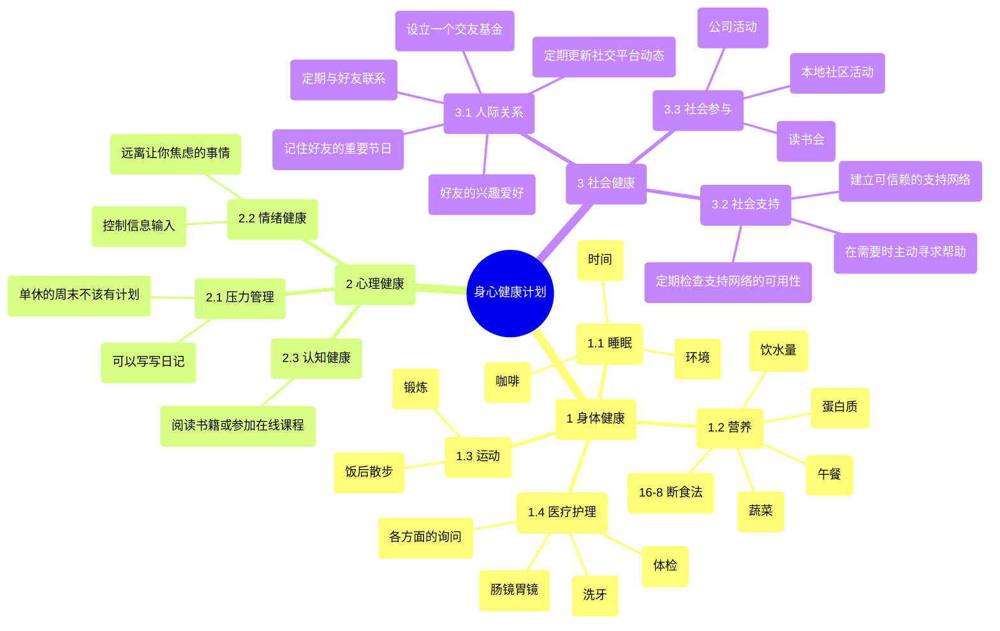
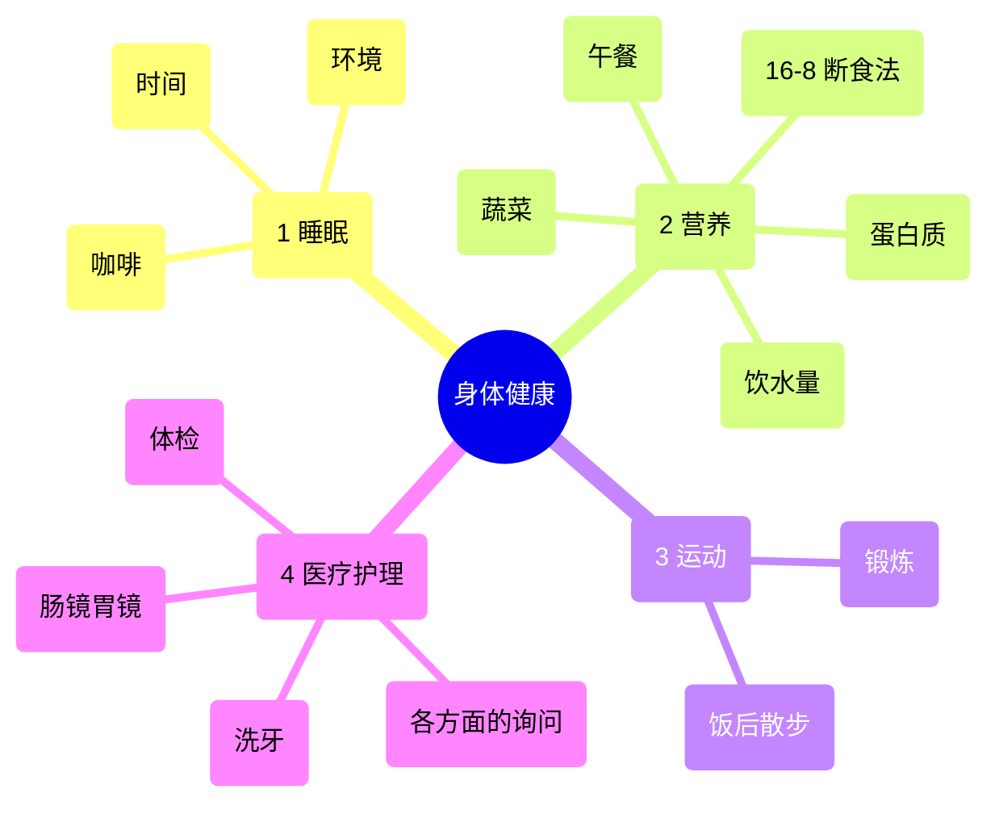
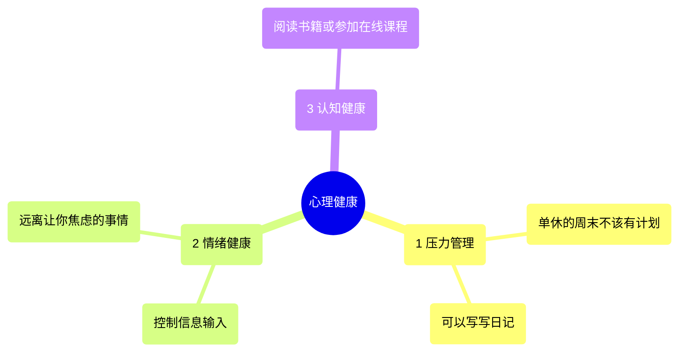
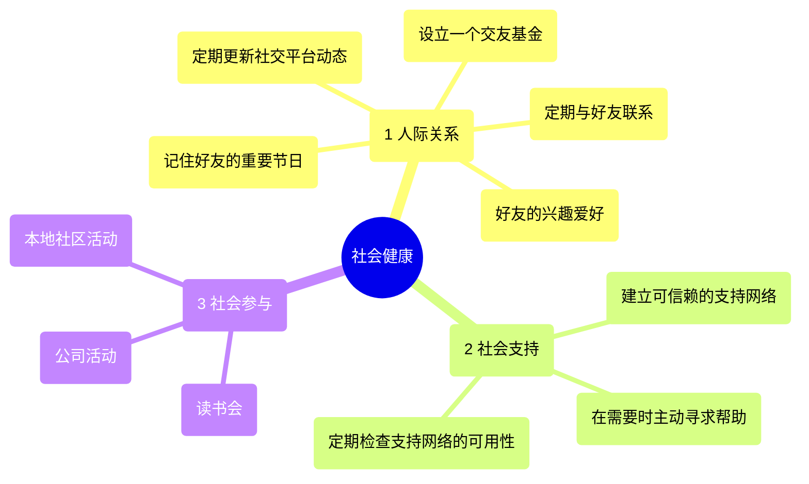

这是我今年工作之余最大的课题，刚好跟公司内部课程的上一章节中最后的 **强制分层检查** 比较接近，于是就拿出来跟大家分享一下了。（最近还在看各种资料，所以有不少地方先省略了）

仅仅从个人视角出发，很多点子并不通用。但是书目中的书籍倒是很推荐大家去看看的，尤其是睡觉那本书。（对于这类书籍，我建议不要只看别人总结的「**健康贴士**」。如果直接跳到结论，而不去阅读书中的推导和论证过程，就很难真正体会到每条建议的重要性。）

## 🎯 整体框架

## 🌟 身心健康计划

「如何恢复并保持身心健康？」在这个模型中就是属于 **L1 主问题/核心指示**。为了分解这一目标，我参考了生物 - 心理 - 社会模型（biopsychosocial model）[^1]，选择了以下三个维度：

- **身体健康**：关注身体的生理状态，包括饮食、运动、睡眠和医疗护理。
- **心理健康**：关注心理和情感状态，包括压力管理、情绪调节和认知功能。
- **社会健康**：关注社会关系和支持网络，包括家庭、朋友和社区参与。

ps. 也有请教了 Grok [^13]，不过大多数观点在此之前都已经是有记录的，这次主要是练习一下这个分层模型重构了一下结构。

## 🏥 身体健康

关注身体的生理状态，包括饮食、运动、睡眠和医疗护理。

### 😴 睡眠

睡眠质量如何，是否符合推荐的 7-9 小时。[^2] （**这或许是这篇文章中唯一最重要的事情**。睡眠不足不仅会让人更容易暴饮暴食，还会降低日常的代谢水平。也极度影响心理健康与专注力）

- **时间**：22:00 洗漱、吹干头发、躺床上看些不用费脑的床头读物 (如传记)、服用 0.3mg 褪黑素 [^3]，大概 23:00-7:15 [^6]
- **其他**：早上到公司后喝一杯咖啡（不加糖）

 
移除列表

- **环境**：22:00 后不接触电子设备，卧室也不要有电子设备，可以看实体书 (使用 [JOMO](https://jomo.so) 限制)

### 🥗 营养

饮食是否均衡，是否摄入足够的维生素和矿物质。[^5]

- **蛋白质**：两餐之间乳清蛋白粉蛋白粉 (20g)
- **午餐**：减少碳水摄入 [^9][^10]，~~到不午睡也不会困的量~~。餐后服用维生素 B 和 C。
- **饮水量**：用一个 2L 的水瓶，目标就是每天下班喝完。（不能碰任何饮料 [^7]）

 
移除列表

- **蔬菜**：~~4d/w 带沙拉到公司饭堂吃饭前吃（午饭餐前 70g，一次两天，准备 2 个盒子）~~ 还需要再考虑一下，操作还是有点复杂了
- **16-8 断食法**：~~仅吃午饭和晚饭。[^8]~~ 公司投喂早餐了，没办法做到。

### 🏃 运动

每周运动频率和强度是否足够（例如，有氧运动、力量训练）。

- **锻炼**：3h/w，力量训练和有氧训练比例控制到 1:1 [^11]，可以考虑健身房跟随 [B站健身视频](https://www.bilibili.com/cheese/play/ep57187) 锻炼。==暂时是鸽子状态，很少能做到==
- **饭后散步**：20 min [^10] 期间可以听书。（例如下面的那些书目，我很多都是这个时候听的）

### 🏥 医疗护理

是否定期体检，慢性病是否得到管理。

- **体检**：标准体检 + 打鼾检测、营养素及身体成份分析、腰椎疾病初筛。体检前停止各种药物摄入。（本来打算六月初，但好像公司会有组织体检，所以就搁置了）
- **洗牙**：1t/y，一般也是一年一次，看看有没有蛀牙智齿之类的。（很幸运，我到现在都没蛀过牙，智齿也没歪）
- **肠镜胃镜**： Ny/t，这个一般到 35 以后就要每隔几年照一次了，我父母以及一些亲戚朋友都在这个方面遭殃过。
- **各方面的询问**：有时候单看这些书还是不够的，理解可能会有误差，此时可以到医院询问医生。例如我睡眠和牙齿方面是有看医生的。

## 🧠 心理健康

> 没怎么研究过，先鸽着。

关注心理和情感状态，包括压力管理、情绪调节和认知功能。

### 😌 压力管理

如何应对日常压力，是否有有效的放松技巧。

- **单休的周末不该有计划**：单休的周末应该用来放松，而不是安排各种活动。
- **可以写写日记**：写日记可以让我将一些事情记录下来，并且可以让我更好地理解自己的情绪和行为。一些想喷人的事情也可以写下来，与朋友分享什么的。心情会好很多，线上语音聊天的效果会好些。

### 😌 情绪健康

是否能识别和管理负面情绪，如焦虑或抑郁。

- **控制信息输入**：短视频、微博、一期播客、一篇文章，应该减少这种短篇幅的信息载体的摄入，千万要小心的是不要被碎片化的信息占据了空闲时间。[^12]
- **远离那种让你焦虑的事情**：上面也有涉及到了，不过我这里特指 nga、v2ex、贴吧、以及各种向你大脑倒垃圾的传播负面情绪的论坛。（==虽然说有点主观==）

### 📚 认知健康

是否保持大脑活跃，例如通过学习或解谜。

- **阅读书籍或参加在线课程**：保持大脑活跃。多看一些国外名人的传记也好啊。
- **在家工作日的晚上，不主动用电子设备**：这个是在回收注意力了。

## 👥 社会健康

关注社会关系和支持网络，包括家庭、朋友和社区参与。

### 🤝 人际关系

> 这也是我今年比较有兴趣的课题，有可以向做销售的朋友请教一下，通过「维护客户关系」的方案来「维护人际关系」。最近小有成效了。

与家人、朋友的互动频率和质量如何。

- **定期更新社交平台动态**：1t/w， 定期发朋友圈可以缓解好友之间许久没见的尴尬。不会说见面以后不知道聊什么。朋友圈就是上一代的社区。
- **定期与好友联系**：我有一个 Reminder list， 会将不同好友定一个周期时间，然后定期看一下他们的朋友圈或者各种社交平台。没话题也要找话题聊两句。
- **记住好友的重要节日**：一般我会在生日当天发个小红包，或者送个小礼物。
- **好友的兴趣爱好**：一般看见好友喜欢的一些东西时，可以拍照转发什么的。
- **设立一个交友基金**：X00 元/m， 用于每个月与朋友出来玩时候的花销。

### 🛟 社会支持

是否有可靠的支持网络，可以在需要时寻求帮助。（==这个没有怎么实践==）

- 建立一个可信赖的支持网络，包括家人、朋友或导师。
- 在需要时主动寻求帮助，例如在面临重大决定时。
- 定期检查支持网络的可用性，确保关系健康。

### 🎉 社会参与

是否积极参与社区活动或志愿者工作

- **读书会**：一般我大概两个月会去一次朋友公司周末的读书会。
- **公司活动**：最近我们公司每周三也有学习会，参与的过程也是挺有意思的，可以见到不同的同事非工作的一面。
- **本地社区活动**：例如最近有在 [取伙](https://www.quhuo.com.cn/Home) 小程序上关注各种电影观影会，以后就不愁自己一个人去看电影了～～（谢谢 raye 的推荐）

## 📋 方法论与工具

### 📊 强制分层检查

| **级别** | **描述** | **示例**                                        |
| ------ | ------ | --------------------------------------------- |
| **L1** | 主问题    | 恢复并保持身心健康                                     |
| **L2** | 维度级    | 身体健康、心理健康、社会健康                                |
| **L3** | 子问题    | 身体：营养、运动、睡眠 心理：压力管理、情绪健康 社会：人际关系、社会支持   |
| **L4** | 行动级    | 营养：制定均衡饮食计划 压力管理：每天冥想 10 分钟 人际关系：定期联系家人 |

- **优先排序**：根据重要性和紧迫性安排行动。例如，如果睡眠质量差或压力过高，可优先解决这些问题。
- **时间安排**：将行动整合进日常或每周例程。例如，每天早上安排运动，晚上进行冥想。
- **监控与调整**：定期回顾计划，跟踪进展（如记录睡眠时间或压力水平），根据需要调整行动。

额外考虑

- **遵循方案指导**：确保不将解决方案混入 L2（维度级），例如不要在"身体健康"下直接写"每天运动 1 小时"，而应在 L3 下写"运动"作为子问题，在 L4 下写具体行动。
- **证据基础**：行动应基于科学证据，例如营养建议可参考美国农业部（USDA）的饮食指南（[USDA Dietary Guidelines](https://www.dietaryguidelines.gov/))。
- **个性化**：根据个人情况调整计划。例如，如果已有良好的饮食习惯，但社交活动较少，可优先加强社会健康方面的行动。
- **可持续性**：确保计划可长期执行，避免过于激进的目标，如一次性改变所有习惯。

### 📝 身体管理记录表

|  日期   |  早上  |  中午   | 晚上  | 睡眠 (H)   | 体重 (KG) | 运动 (CAL)    | OO (昨) |
| :---: | :--: | :---: | :-- | -------- | ------- | ----------- | ------ |
| 11.12 | 🥚🥚 | 堂 + 汤 | 蛋白 + 🍲  | 6.19(75) | +7(30%)    | - | YES    |
| 11.13 | 肠粉 + 🥚🥚 | 堂 + 汤 | 蛋白 + 若  | 6.07(81) | +6.3(30%)    | - | YES    |
| 11.14 | 🥚🥚 | 堂 + 汤 | 蛋白 + 若  | 6.20(-) | +6.7(28.9%)    | - | YES    |
| 11.15 | - | 麦麦 | 烧腊  | 7.0(-) | +6.7(28.9%)    | - | YES    |
| 11.16 | - | 清水火锅 | 清水火锅  | 3.20(-) | +6.9(29.6%)    | 400(🏋️) | YES    |
| - | - | - | -  | - | - | - | - |
| 11.17 | 🥚🥚 | 堂 + 汤 | 清水火锅  | 5.29(62) | +6.9(29.6%)    | - | YES    |
| 11.18 | 🥚🥚 | 堂 + 汤 | 堂 | 5.30(60) | +7(30%)    | - | YES    |
| 11.19 | 🥚🥚 | 堂 + 汤 | 若 + 橘子 | 5.08(67) | +6.9(30.9%)    | 400(🏃) | YES    |
| 11.20 | 🥚🥚 | 堂 + 汤 | 若 + 橘子 | 4.30(-) | +6.9(30.9%)    | 300(🏃) | YES    |
| 11.21 | 🥚🥚 | 堂 + 汤 | 若 + 橘子 | 6.35(89) | +7.1(30.9%)    | 300(🏃) | NO    |
| 11.22 | 🥚🥚 | 堂 + 汤 | 下午茶 + 若 + 橘子 | 5.12(58) | +5.7(32.7%)  | - | NO    |
| 11.23 | 蛋肉肠 | 🍲 | 🍲 + 🍎 | 5.50(71) | +5.6(30.1%)  | 945(🧗) | YES    |
| - | - | - | -  | - | - | - | - |
| 11.24 | 🥚🥚 | 堂 + 汤 | 堂 + 🫛 | 5.07(75) | +5.7(27.7%)  | - | YES    |
| 11.25 | 🥚🥚 | 堂 + 汤 | 若 + 🍎 | 5.22(60) | +6(31.8%)  | 383(🏃) | YES |
| 11.26 | 🥚🥚 | 堂 + 汤 | 若 + 🍎 | 6.19(63) | +5.2(30.4%)  | 307(🏃) | NO |
| 11.27 | 🥚🥚 | 堂 + 汤 | 蛋 + 若 + 🍎 | 5.06(59) | +4.8(31.0%)  | - | NO |
| 11.28 | 🥚🥚 | 堂 + 汤 | 若 + 🍎 | 6.18(82) | +5.5(34.7%)  | - | YES |
| 11.29 | - | 🍲 | 🍲 | 6(-) | +4.4(32.1%)  | - | NO |
| 11.30 | 蛋肉肠 | 烧腊 | 🫛 | 7.25(91) | +4.4(31.9%)  | 1122(🧗) | YES |
| - | - | - | -  | - | 100 | 90 | 95 |
| 12.01 | 🥚🥚 | 20外餐 | 🍲 | 5.46(60) | +5.0(31.4%)  | - | YES |
| 12.02 | 🥚🥚 + 🍞 | 20 外餐 | 麦麦 | 6.33(76) | +5.1(31.5%)  | - | NO |
| 12.03 | 🥚🥚 | 20 外餐 | 若 + 🍊 | 4.43(50) | +5.7(30.1%)  | 预300(🏃) | YES |

## 📚 参考资料

[^1]: [Biopsychosocial model | Wikipedia](https://en.wikipedia.org/wiki/Biopsychosocial_model) - 生物 - 心理 - 社会模型是一种全面的理论框架，由乔治·恩格尔（George Engel）于 1977 年提出，认为健康和疾病的发生与发展不仅受到生物学因素（如基因和生理状态）的直接影响，还与心理因素（如情绪、压力和认知模式）以及社会因素（如文化、经济状况和人际关系）密切相关。这种模型强调个体健康问题的多维度性，倡导在医疗和心理健康干预中综合考虑这些因素，以实现更有效的诊断和治疗。
[^2]: [《我们为什么要睡觉？ 》](https://book.douban.com/subject/35332778/) - 最大的启发是「**我需要的睡眠时间比原先想象的多**」。我此前的睡眠目标是 0:00-7:00，但这错得离谱。通过 Apple Health 我发现我睡眠效率还不到 90%（Sleep Apnea），按这种方法睡就相当于长期睡眠 6H，难怪我一直以来都感觉挺困的（这几年尤为严重，之前还怀疑自己是 ADHD[^4]）
[^3]: [褪黑素研究综述](https://www.lesswrong.com/posts/E4cKD9iTWHaE7f3AJ/melatonin-much-more-than-you-wanted-to-know) - 关于褪黑素的作用以及如何吃，我一般看实体书是 0.3mg 就能睡着，看电子漫画 1.5 也行，不过热血一点的漫画也睡不着。玩游戏是多少都不行。（指的是半个小时内睡着）
[^4]: [《注意缺陷多动障碍》](https://book.douban.com/subject/35140563/) - 了解 ADHD，并通过行为治疗、伙食、睡眠、运动来缓解症状。不过最近睡好之后，各种方面的专注力都好了很多，于是就排除了我是 ADHD 这个选项。
[^5]: [中国居民膳食指南](http://dg.cnsoc.org) - 与公司饭堂饭菜相对比的话，无论是蛋白质还是纤维感觉都不够的，所以需要自己另外加餐。
[^6]: [Apple Watch 睡眠监测](https://support.apple.com/en-us/108906) - 我是睡觉的时候戴着 Apple Watch 来检测睡眠，结果显示一般我睡 8 个小时中间有陆陆续续 1 个小时都是清醒的，大概率是睡眠呼吸暂停综合症（Sleep Apnea），下次体检检查一下。
[^7]: [《疯狂的尿酸》](https://book.douban.com/subject/36591951/)- 认识尿酸对健康的影响，不能喝饮料啦。
[^8]: [Intermittent fasting more effective than calorie restriction](https://pubmed.ncbi.nlm.nih.gov/37889487/) - Hacker News 上的一篇，间歇性断食比限制热量更有效，讲得神乎其神，但其实也还是老一套的热量控制，不过优势是非常好操作。
[^9]: [《我们为什么会发胖？》](https://book.douban.com/subject/26369484/)- 探讨肥胖的成因，对于 IG 值的认识。
[^10]: [《控糖革命》](https://book.douban.com/subject/36707112/)- 了解糖分对身体的影响，那时候我还特意弄了个动态血糖检测仪来观察血糖水平。
[^11]: [Wellness | 椒盐豆豉](https://blog.douchi.space/tags/wellness/#gsc.tab=0) - 也有很多健康方面的借鉴信息，例如健身 Fasting 方面的建议
[^12]: [Feed 内容阅读姿势 | 互联网尾气回收员的自救](https://t.me/tomoko_channel/987) - 之前我在 telegram 上发的一篇宣言，可能有差。
[^13]: [身心健康恢复与维护分析 | Shared Grok Conversation](https://grok.com/share/bGVnYWN5_492d71e1-5f67-46c5-a114-d97921a18022)
