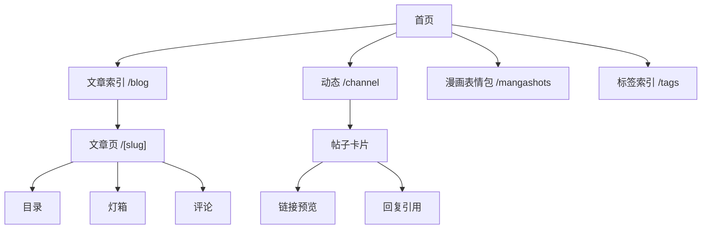

import ColorPalette from "../../../components/design/ColorPalette.astro";
import TypographyScale from "../../../components/design/TypographyScale.astro";
import CardShowcase from "../../../components/design/CardShowcase.astro";
import PillShowcase from "../../../components/design/PillShowcase.astro";
import ButtonShowcase from "../../../components/design/ButtonShowcase.astro";
import ShadowShowcase from "../../../components/design/ShadowShowcase.astro";
import RadiusShowcase from "../../../components/design/RadiusShowcase.astro";
import SpacingShowcase from "../../../components/design/SpacingShowcase.astro";
import Spoiler from "../../../components/Spoiler.astro";
import ThemeToggle from "../../../components/ThemeToggle.astro";
import MusicPlayer from "../../../components/MusicPlayer.astro";

## Overview（概述）

本文采用 Apple Human Interface Guidelines (HIG) [^1] 的分类方式组织，从基础到具体：Foundations → Patterns → Components。设计元素的取舍受《写给大家看的设计书》[^10] 启发，展示方式参考了 awesome-design-md [^9] 项目，机器可读的 DESIGN.md 原文可通过 [/design.md](/design.md) 访问（很奇妙吧，加个 .md 就可以了）。

| HIG 原则    | 博客体现                                          |
| ----------- | ------------------------------------------------- |
| Clarity（清晰）    | 内容优先，UI 元素用途一目了然，无装饰性复杂度     |
| Consistency（一致）| 统一的 token 系统，相同组件在不同页面使用相同样式 |
| Deference（克制）  | 克制的 hover 效果，动效保持最小化，UI 不干扰阅读  |

## Foundations（基础）

### Color（色彩）

配色只有两点是我认为重要的:

1. Obsidian Shiba Inu 主题 [^2]: 我在用的一个主题，最开始就是让 Claude 模仿其中的配色，不过后面逐渐走偏，变成了当前的风格。
2. **#FB8F68**: 这个颜色源于《宝石之国》的一个角色莲花刚玉 [^3]，我心目中的偶像。尽可能地，我希望用这个颜色来代表我，所以一般我认为需要强调的重要的，我都会用这个颜色。<Spoiler>四舍五入，看见这个颜色就相当于看见我了</Spoiler>

切换页面主题可查看深色 / 浅色效果。(然后你会发现强调色都是 **#FB8F68** 😂)

<ColorPalette />

### Typography（排版）

基础字号 17px，符合 Apple HIG 推荐的移动端阅读标准。标题行高 1.22（紧凑），正文行高 1.75（宽松，适合长时间阅读），中文字距 0.01em。

中英文统一使用 open 粉圓 [^4]（`jf-openhuninn-2.0`），来自台湾字型团队 justfont 的开源字体。第一次知道 justfont 是通过一期播客 [^5]，后来挑选字体时发现他们有开源的粉圓體，圆润温暖的笔画很契合博客的调性，就用上了。

<TypographyScale />

### Dark Mode（深色模式）

正文行长控制在一行 60-80 个字符左右，避免阅读时视线来回跳太远。其余间距和圆角没什么特别的，看页面就能感受到。

深色模式采用三态循环切换：system → light → dark → system，状态保存在 `localStorage`，页面加载时提前注入避免闪烁。保持暖色调基底（夜棕 `#140e0b` 而非冷黑），阴影更厚重以在深色背景上保持深度感知。

## Patterns（模式）

### Content Architecture（内容架构）

站点包含三种内容类型：长文（`blog`）、月记（`monthly`）、TIL（`til`），三者共享统一的 frontmatter schema、排版样式和标签索引系统。

动态内容方面，Telegram 频道（`/channel`）采用 SSR 渲染 + 5 分钟缓存，双栏布局，支持链接预览、回复引用和长帖自动折叠。漫画表情包（`/mangashots`）使用无限滚动 + Cloudflare D1 存储。

### Interaction（交互）

桌面端使用固定顶部导航栏，移动端切换为抽屉式导航。所有模态场景（灯箱、抽屉、目录）共享统一行为：ESC 或点击遮罩关闭、打开时锁定滚动、关闭后焦点回到触发元素。

主题切换采用三态循环按钮，点击依次切换 system → light → dark：

<ThemeToggle variant="header" />

## Components（组件）

### Cards（卡片）

卡片是最常用的容器组件，提供 5 种变体。Hover 效果仅限边框颜色变化，不使用 `translateY` 上浮——保持视觉克制。

<CardShowcase />

### Buttons（按钮）

博客只使用图标按钮（`.icon-btn`），不含文字。所有尺寸满足 44px 最小触控目标，hover 时文字颜色变为 accent，无位移或缩放。

<ButtonShowcase />

### Pills & Tags（标签）

`.pill` 组件用于文章标签和过滤器，背景使用强调色的淡化版本，hover 时背景加深、边框显现。

<PillShowcase />

### Shadow & Elevation（阴影与层级）

深色模式下阴影透明度更高（更「厚重」），因为深色背景需要更强的阴影才能感知到深度。

<ShadowShowcase />

### Border Radius（圆角）

<RadiusShowcase />

### Spacing（间距）

<SpacingShowcase />

### Spoiler（剧透遮罩）

点击黑色区域揭示隐藏内容，用于剧透或彩蛋：<Spoiler>你发现了一个秘密 🎉</Spoiler>

### Lightbox（灯箱）

点击图片可打开灯箱预览，支持键盘 ← → 切换、ESC 关闭。更多表情包见 [/mangashots](/mangashots)。

  
  
  
  
  
  
  
  
  

### Music Player（音乐播放器）

内嵌播放器组件，支持网易云音乐，黑胶唱片旋转动画。这首来自 VA-11 Hall-A 的赛博酒吧：

<MusicPlayer id="8543906567" type="playlist" server="netease" />

## Guidelines（设计原则）

Do:

- 所有颜色使用 CSS 变量，不硬编码 hex
- 使用语义化 Tailwind token（`text-secondary`、`bg-surface`）
- Hover 效果仅限颜色/边框变化
- `<strong>` 用强调色渲染
- 尊重 `prefers-reduced-motion`

Don't:

- 不要在 hover 时使用 `translateY` 位移动画
- 不要新增阴影层级——只用 `shadow-soft` 和 `shadow-strong`
- 不要引入新字体或更改 17px 基础字号
- 不要绕过三态主题切换（system/light/dark）

所有文字配色满足 WCAG AA 标准 [^6]（4.5:1+），可交互元素满足 Apple HIG [^1] 44x44pt 最小触控目标。键盘导航支持 ESC 关闭对话框、← → 切换灯箱图片、Tab 循环焦点。检测到 `prefers-reduced-motion` 时禁用所有动画。

## References（参考资料）

[^1]: [Apple Human Interface Guidelines](https://developer.apple.com/design/human-interface-guidelines) - Apple 官方设计规范，涵盖 Clarity、Consistency、Deference 三大原则以及色彩、排版、无障碍等全部设计领域。本文的章节结构（Foundations → Patterns → Components）直接参考了 HIG 的组织方式。
[^2]: [Obsidian Shiba Inu 主题](https://github.com/faroukx/Obsidian-shiba-inu-theme) - 一款暖色调 Obsidian 主题，开源可自行安装体验。
[^3]: [莲花刚玉 | 萌娘百科](https://zh.moegirl.org.cn/%E5%AE%9D%E7%9F%B3%E4%B9%8B%E5%9B%BD:%E8%8E%B2%E8%8A%B1%E5%88%9A%E7%8E%89) - 《宝石之国》中的角色，博客强调色 #FB8F68 的灵感来源。
[^4]: [open 粉圓 | justfont](https://justfont.com/huninn/) - justfont 的开源圆体字体，可免费下载使用。
[^5]: [帶你認識「字型設計師」！ft. justfont | YouTube](https://www.youtube.com/watch?v=6ZxsXCtW2mU&t=80s) - 好客室播客第 83 期，聊台湾字体设计师的工作日常。
[^6]: [WCAG 2.1 Understanding Docs](https://www.w3.org/WAI/WCAG21/Understanding/) - W3C 的无障碍标准解读文档，逐条解释每个成功准则的含义和达标方法。博客的对比度（4.5:1+）和触控目标（44px）等要求均来源于此。
[^7]: [Astro Documentation](https://docs.astro.build) - 博客使用的静态站点框架，支持 MDX、内容集合、Island 架构。文档写得非常清晰，基本上遇到的问题都能在这里找到答案。
[^8]: [Tailwind CSS Documentation](https://tailwindcss.com/docs) - 博客的样式系统基础，v4 开始支持 `@theme inline` 直接映射 CSS 变量为 utility class，省去了大量配置。
[^9]: [awesome-design-md](https://github.com/VoltAgent/awesome-design-md) - 从知名网站提取设计系统的开源项目，提供标准化的 DESIGN.md 格式和可视化预览。本文的组件展示方式受其启发。
[^10]: [写给大家看的设计书（第4版）](https://book.douban.com/subject/26664522/) - 亲密性、对齐、对比、重复。对于完全没有设计感的人来说，具象化了这四个名词，让跟 AI 聊博客设计的时候方便了不少。
