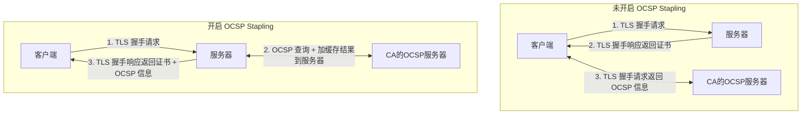

> 总感觉有更好的办法，就作为抛砖引玉发出来吧。欢迎多多吐槽。

## 需求

在国内网络环境下，网站的 TLS 安全证书可能因为 DNS 问题而导致 Online Certificate Status Protocol（OCSP）服务器无法正常访问。OCSP 负责实时验证网络中 SSL/TLS 证书的吊销状态。

例如，当我们尝试通过 curl 命令行工具访问一个使用 schannel（Windows 原生的TLS库）的网站时，由于证书状态不能被在线验证，就可能遭遇类似下面这样的错误:

> 我此处用的是 digicert 的证书，ocsp 服务器是 ocsp.digicert.com。在该服务器被墙或者无法访问的情况下，导致证书状态验证失败。若是用过 let‘s encrypt 证书的同学，应该更加深受其害吧～～

```bash
$ curl -v https://hub.x-cmd.com
*   Trying 47.113.155.92:443...
* Connected to hub.x-cmd.com (47.113.155.92) port 443 (#0)
* schannel: disabled automatic use of client certificate
* ALPN: offers http/1.1
* schannel: next InitializeSecurityContext failed: Unknown error (0x80092013) - 由于吊销服务器已脱机，吊销功能无法检查吊销。
* Closing connection 0
* schannel: shutting down SSL/TLS connection with hub.x-cmd.com port 443
curl: (35) schannel: next InitializeSecurityContext failed: Unknown error (0x80092013) - 由于吊销服务器已脱机，吊销功能 无法检查吊销。
```

ps. schannel 版本的 curl 会默认启动「证书状态验证」，而 openssl 版本的 curl 则不会。所以用 openssl 版本的 curl 即使验证不通过，也是能正常获取结果的。

## 解决方案概览：引入OCSP Stapling

OCSP Stapling 是一种优化的在线证书检查方法，它通过让网站服务器代替客户端提前获取并「附带」（staple）OCSP认证结果，避免了每个客户端分别查询 OCSP 服务器的需要。这不仅减少了握手过程中的延时，还降低了 OCSP 服务器的负载。

### OCSP Stapling工作机制

在传统模式下，客户端需要在 TLS 握手过程中与 CA 的 OCSP 服务器进行额外的回合通讯来确认服务端证书的有效性。OCSP Stapling 通过以下方式简化了这一过程：

1. 在 TLS 握手请求时, 客户端请求服务端提供证书状态。
2. 服务端定期从 CA 的 OCSP 服务器获取签名的证书状态响应并缓存。
3. 当有新的 TLS 握手请求时，服务端将缓存的 OCSP 响应「附带」在证书后一起发给客户端。

这种机制避免了 **客户端直接请求 OCSP 服务器**，从而减少了 TLS 握手的延迟。同时，它也减少了 OCSP 服务器的负载，因为它不再需要为每个客户端请求提供响应。（也不用怕 ocsp 服务器被墙了）

下面是这个过程的简化示意图：



下面这个是阿里云的，可能更好的图:


## 使用 ocsp 库开启 OCSP Stapling

我们可以使用 ocsp 库来在 Node.js 服务器上实现 OCSP Stapling。由于该库已不再维护，TypeScript用户可能需要参考 [这个 pr](https://github.com/indutny/ocsp/pull/41) 中的修复。安装完成后，您可以按以下方式配置服务器：

> 在原有的 node server 的基础上，添加 server 的 OCSPRequest 事件，然后在事件中返回 OSCP 信息即可。

```typescript
import ocsp from "ocsp"

// Create cache for OCSP (it'll be used to respond to OCSP stapling requests)
const cache = new ocsp.Cache()

server.on('OCSPRequest', (cert, issuer, cb) => {
    ocsp.getOCSPURI(cert, function (err, uri) {
        if (err) return cb(err, Buffer.alloc(0))
        if (uri === null || uri === undefined) return cb(null, Buffer.alloc(0))

        const req = ocsp.request.generate(cert, issuer)
        cache.probe(req.id.toString(), function (err, cached) {
            if (err) return cb(err, Buffer.alloc(0))
            if (cached !== false) return cb(null, cached.response)

            const options = {
                url: uri,
                ocsp: Buffer.from(req.data)
            }

            cache.request(req.id, options, cb)
        })
    })
})
```

## 可能存在的问题

1. 服务器缓存的 OCSP 信息可能会过期，需要定期更新。此处的 ocsp 库已经帮我们做了这个事情。
2. 服务器与 CA 的 OCSP 服务器之间的网络可能会出现问题，导致无法获取到 OCSP 信息。此时应当退化为客户端请求 OCSP 服务器的方式。服务器方不应当因为无法获取到 OCSP 信息而拒绝客户端的请求。

## 参考资料

- [提升 TLS 性能30%？谈谈在 Node.JS 上的 OSCP Stapling 实践](https://segmentfault.com/a/1190000004045710) - 写得很好的一篇文章，思想是没有过时的，但是 ocsp 这个库已经不维护了。
- [How to enable ocsp?](https://github.com/indutny/ocsp/issues/14) - 我一直在想，是因为外国人的网络环境比较好，所以他们不会遇到这个问题吗？资料是真的少，又没有这个相关的库。


